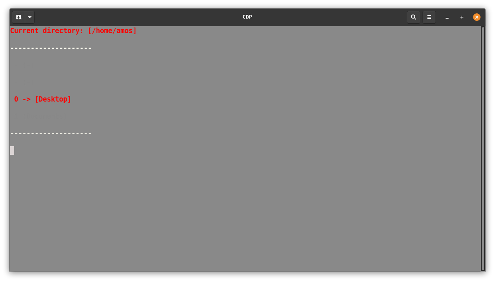
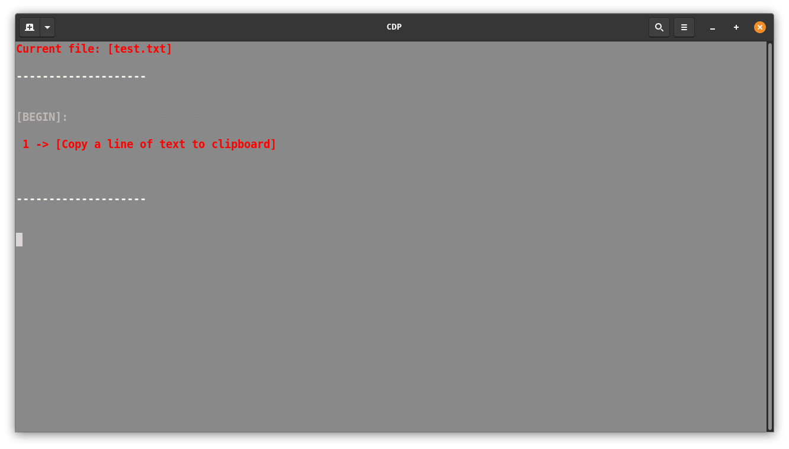

# change-directory-plus
A minimalistic efficiemt python alternative to change the terminal working directory.

## Meta
	CDP is a user friendly way to navigate directorys inside the terminal 

| Help to support this project with a Paypal donation to AKUMA |

## Screenshot

## How to use
	Move selection up = w
	Move selection down = s
	Move into selected directory = a
	Move out of current directory = d
	Enter directory = e
	Quit terminal = escape
	exit cdp = q
	Search file name = f
	Search index integer = r
	return to the home/user directory = c
	show/hide hidden directory = v
	
## Alternative keys
	Move selection up = up arrow
	Move selection up = k
	Move selection down = down arrow
	Move selection up = j
	Move into selected directory = right arrow
	Move into selected directory = l
	Move out of current directory = left arrow
	Move out of current directory = left h
	Enter directory = enter

## Tips
	Add the following to your bashrc file to use more efficiently:
	alias cdp = python3 /home/"file direcory"/cdp.py

	To show hidden content use:
	Use python3 /home/"file direcory"/cdp.py -sh

## Installation
	(not yet available)

## Features currently in development (Not yet implemented to the repository):
	 Rename files and directorys
	 Copy a line of text to clipboard
	 Edit a line of text in a file.
	 Create new file and directory
	 Lunch application
	 Delete files and directorys
	 (working) Open a terminal at a (selected directory) without closing cdp.
	 (working) Open the directory and file with the default gui file manager
	 (working) Vim keys (H,J,K,L)

## Release History
	Alpha
	
AKUMA open source project by Amos Nimos
